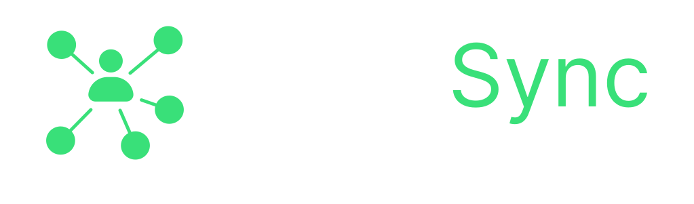

# CodeSync - Realtime Collaborative Code Editor



CodeSync is a powerful, real-time collaborative code editor that allows multiple users to write and execute code together in a shared environment. Built with modern web technologies, it provides a seamless experience for pair programming, teaching, and collaborative development.

## ✨ Features

- **Real-time Collaboration**: Multiple users can edit code simultaneously in the same room at same time.
- **Multiple Language Support**: Write and execute code in JavaScript, Python, Java, and C++.
- **Live Code Execution**: Run your code directly in the browser and see the output instantly.
- **User Presence**: See who's currently in your room and when they're typing.
- **Room-based Collaboration**: Create or join rooms with unique IDs for private collaboration.
- **Responsive Design**: Works seamlessly across desktop and mobile devices.
- **Custom Input Support**: Provide custom input for your code execution.
- **Modern Code Editor**: Powered by Monaco Editor with syntax highlighting and autocomplete.

## 🚀 Tech Stack

- **Frontend**:
  - React 19
  - Vite
  - Socket.IO Client
  - Monaco Editor
  - Modern CSS3

- **Backend**:
  - Node.js
  - Express
  - Socket.IO
  - Piston API for code execution

## 🛠️ Installation

1. Clone the repository:
   ```bash
   git clone https://github.com/heyymateen/CodeSync.git
   cd CodeSync
   ```

2. Required Configuration Changes:
   
   You need to update the server URLs in two files to run the project locally:

   a. In `frontend/src/App.jsx`:
   ```javascript
   // Change this line (around line 12):
   const socket = io("https://codesync-6n4p.onrender.com");
   // To:
   const socket = io("http://localhost:5000");
   ```

   b. In `backend/index.js`:
   ```javascript
   // Change this line (near the beginning of the file):
   const url = `https://codesync-6n4p.onrender.com`;
   // To:
   const url = `http://localhost:5000`;
   ```

3. Install dependencies for both frontend and backend:
   ```bash
   # Install root dependencies
   npm install

   # Install frontend dependencies
   cd frontend
   npm install
   ```

3. Create a build of the frontend:
   ```bash
   npm run build
   ```

4. Start the server:
   ```bash
   cd ..
   npm start
   ```

The application will be available at `http://localhost:5000`

## 🚦 Development

To run the application in development mode:

1. Start the backend server:
   ```bash
   npm run dev
   ```

2. In a separate terminal, start the frontend development server:
   ```bash
   cd frontend
   npm run dev
   ```

The frontend development server will be available at `http://localhost:5173`

## 🌟 Usage

1. Open the application in your browser.
2. Enter a Room ID (or generate one) and your username
3. Share the Room ID with others to collaborate
4. Start coding together in real-time
5. Use the sidebar to:
   - Change programming language
   - Provide input for code execution
   - Run code and see output
   - View active users in the room

## 🔒 Environment Variables

- `PORT`: Server port (default: 5000)

## 📱 Responsive Design

CodeSync is designed to work across all device sizes:
- Desktop: Full-featured experience
- Tablet: Optimized sidebar and editor layout.
- Mobile: Adaptive interface with collapsible panels

## � Deployment on Render

You can deploy this project on Render.com by following these steps:

1. Create a new Web Service on Render:
   - Fork this repository to your GitHub account
   - Go to [Render Dashboard](https://dashboard.render.com)
   - Click "New +" and select "Web Service"
   - Connect your GitHub repository

2. Configure the Web Service:
   - **Name**: Choose a name for your service (e.g., `codesync`)
   - **Root Directory**: Leave empty
   - **Environment**: `Node`
   - **Build Command**: `npm install && cd frontend && npm install && npm run build`
   - **Start Command**: `npm start`

3. Update URLs in code:
   After deployment, update these URLs with your Render service URL:
   
   a. In `frontend/src/App.jsx`:
   ```javascript
   const socket = io("https://your-app-name.onrender.com");
   ```
   
   b. In `backend/index.js`:
   ```javascript
   const url = `https://your-app-name.onrender.com`;
   ```

4. Deploy:
   - Click "Create Web Service"
   - Wait for the build and deployment to complete

Your application will be available at `https://your-app-name.onrender.com`

> Note: Free tier of Render may have cold starts. The first request after inactivity might take a few seconds.

## �📄 License

This project is licensed under the ISC License. See the `package.json` file for details.

## 🙏 Acknowledgments

- [Monaco Editor](https://microsoft.github.io/monaco-editor/) for the powerful code editing experience
- [Socket.IO](https://socket.io/) for real-time communication
- [Piston API](https://github.com/engineer-man/piston) for code execution

---

Built with ❤️ by [Ayan](https://github.com/aynayan321)
